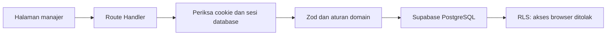

# Arsitektur implementasi awal

## Alur data

Browser tidak memakai kunci Supabase. Route Handler memeriksa sesi sebelum membaca/menulis data. Mutasi juga memeriksa Origin. Kunci layanan hanya digunakan dalam `lib/server/db.ts` yang diberi batas `server-only`.

## Penyimpanan ringkas

Skema enam tabel dijelaskan dalam [SUPABASE](SUPABASE.md), dan disetujui pemilik untuk proyek baru. `hub_records` berisi envelope `id`, `entity`, `data`, `created_at`, `updated_at`, dan `recurrence_key` opsional. `data` adalah JSONB dengan skema Zod **berbeda untuk setiap domain**. Enam belas domain memiliki allowlist tetap, bukan nama tabel dari input pengguna.

Keputusan ini menyederhanakan fondasi satu manajer. Konsekuensinya, query analitik lintas domain dan paginasi skala besar belum dioptimalkan seperti tabel terpisah. Relasi ID, dependensi melingkar, profil tunggal, dan kode bidang kerja tetap diperiksa database. Batas daftar 5.000 catatan per domain gagal jelas, bukan memotong angka dashboard diam-diam.

Kontrak API dan skema memisahkan kebutuhan UI dari penyimpanan. Bila skala membutuhkan normalisasi, pecah layanan dan migrasikan domain secara bertahap, disertai cadangan dan tes. Jangan menjalankan SQL reset lama.

## Modul kode

- `features/schemas.ts`: validasi dan tipe domain; tidak mengandung koneksi database.
- `features/catalog.ts`: label formulir, referensi, pilihan status, dan navigasi.
- `features/service.ts`: baca/simpan domain, pemeriksaan relasi dan dependensi.
- `features/Editor.tsx`: form lengkap atau tambah cepat; skema yang sama dipakai sebelum permintaan.
- `features/Records.tsx`: daftar/papan/aksi catatan. Kalender dipisah dalam `TaskCalendar`.
- `features/Dashboard`, `Roadmap`, `Reports`, `Settings`: logika tampilan per kebutuhan.
- `features/report-snapshot.ts`: pemilihan periode laporan yang dipakai server.
- `lib/progress.ts`: rumus bersama. Tanpa checklist wajib berarti belum dinilai, bukan 100% siap.
- `lib/date.ts`: tanggal kalender dan WIB, termasuk pengulangan bulanan pada akhir bulan.
- `lib/templates`: rencana dari 43 baris tugas dan enam milestone dalam checklist asli.

## Transaksi dan keamanan

PIN di-hash scrypt dengan salt acak. Token sesi 32 byte acak; database menyimpan SHA-256 token. Cookie HttpOnly, SameSite Strict, Secure pada produksi, masa berlaku 12 jam. PIN lama tidak memiliki fallback.

Pembatasan lima percobaan dan penguncian 15 menit disimpan pada satu baris terkunci PostgreSQL. Jeda antarpencobaan bertambah. Login memverifikasi bahwa hash PIN belum berubah sebelum menyimpan sesi. Pergantian PIN mencabut semua sesi.

Template, tugas berulang, dan pemulihan berjalan sebagai transaksi database. Template idempoten. Tugas lanjutan memakai kunci unik dari ID asal dan tenggat agar klik selesai berulang tidak menggandakannya. Restore mengganti catatan dan snapshot laporan secara atomik; sesi, hash PIN, dan log audit tidak termasuk cadangan pengguna.

## Batas yang perlu dijaga

- Burnup adalah rekonstruksi dari tugas saat ini, bukan riwayat perubahan cakupan lengkap.
- Gantt awal menampilkan rentang tanggal; baseline, edit dengan menyeret, dan jalur kritis belum tersedia.
- Laporan berisi kondisi saat snapshot dibuat. Status historis risiko/tugas yang sudah dibuka ulang tidak direkonstruksi ke masa lalu.
- Tautan dokumen divalidasi HTTP/HTTPS; unggah berkas belum tersedia.
- Aplikasi belum offline/PWA, dan tidak mengirim WhatsApp/email otomatis.
- UAT tiga hari, Lighthouse, dan perangkat Safari iOS/Chrome Android tetap perlu verifikasi terpisah.

## Proyek dan pengalaman ruang kerja

`Projects.tsx` menampilkan galeri dan detail proyek melalui `/proyek?id=<uuid>`. Sumber datanya tetap `workstreams`, diperkaya tujuan, catatan, PIC, tanggal mulai dan target. Nilai baru memiliki default agar catatan template lama tetap terbaca. `Records` menerima `scopeId` untuk menyaring tugas tanpa membuang konteks relasi/prasyarat dari workspace. Tugas baru dari proyek otomatis membawa `workstream_id`.

Tampilan daftar memakai tabel yang bergulir di dalam kontainer; papan dan kalender memakai sumber data/filter yang sama. Semua penyimpanan melewati API dan schema server yang sama, bukan penyimpanan terpisah di browser.
