> Pembaruan pemilik: baca [KEPUTUSAN.md](KEPUTUSAN.md). Dokumen ini adalah rancangan; progres aktual ada di [STATUS.md](STATUS.md).

# Workflow — Puntukrejo Manager Hub

Tiga alur: **(1)** alur pengembangan, **(2)** alur kerja harian–bulanan manajer di aplikasi, **(3)** alur status data.
Diagram memakai Mermaid (tampil otomatis di GitHub/VS Code).

Rujukan: [PRD](PRD.md) · [Checklist](CHECKLIST.md) · [Pemetaan File](PEMETAAN-FILE.md)

---

## 1. Alur Pengembangan

### 1.1 Tahapan

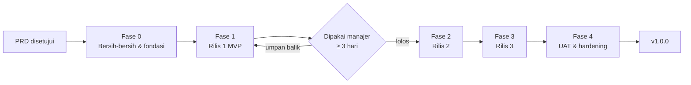

### 1.2 Alur satu fitur

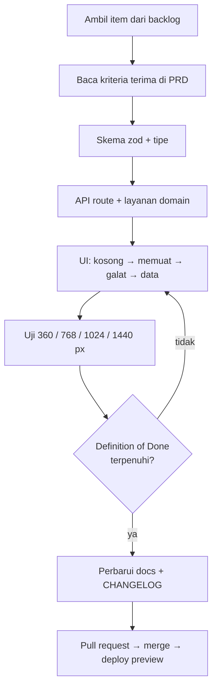

### 1.3 Aturan cabang dan commit
- Cabang: `main` (stabil) ← `redesign/manager-hub` ← `feat/<modul>-<hal>`.
- Tag `v0-legacy` pada kode lama sebelum penghapusan apa pun.
- Commit: `feat(tugas): papan seret-lepas`, `fix(gantt): konflik dependensi`, `chore(cleanup): hapus modul anggota`, `docs: perbarui PRD`.
- Satu PR = satu modul/perubahan; PR penghapusan dipisah dari PR fitur.

### 1.4 Urutan pembersihan yang aman

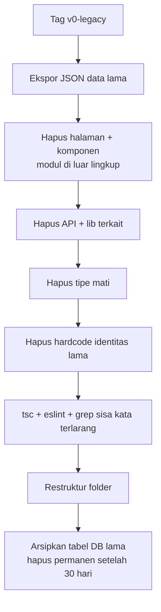

### 1.5 Lingkungan
| Lingkungan | Tujuan | Catatan |
|---|---|---|
| Lokal | Pengembangan | `.env.local`, Supabase proyek dev |
| Preview (Vercel) | Tinjau tiap PR | Data uji, bukan data nyata |
| Produksi | Dipakai manajer | Migrasi DB dijalankan manual dengan cadangan |

Variabel lingkungan tidak pernah di-*commit*; sediakan `.env.example` tanpa nilai rahasia.

### 1.6 Kerangka kualitas
Sebelum merge: `tsc --noEmit` · `eslint` · uji komponen inti · Lighthouse pada halaman utama · cek manual di ponsel.

---

## 2. Alur Kerja Manajer di Aplikasi

### 2.1 Siklus harian

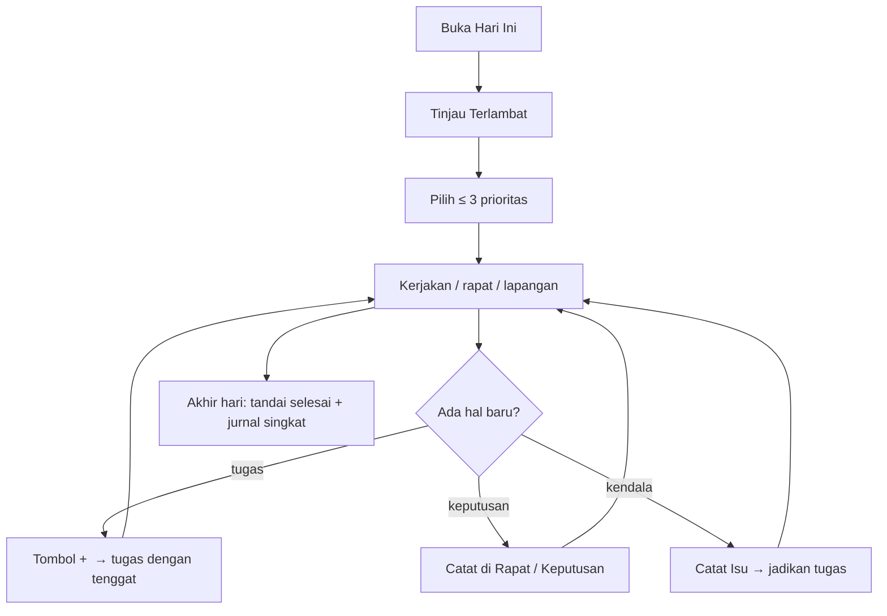

### 2.2 Siklus mingguan

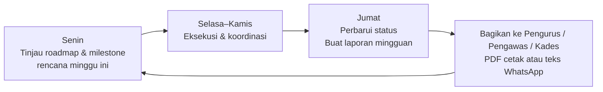

### 2.3 Alur rapat → tindak lanjut

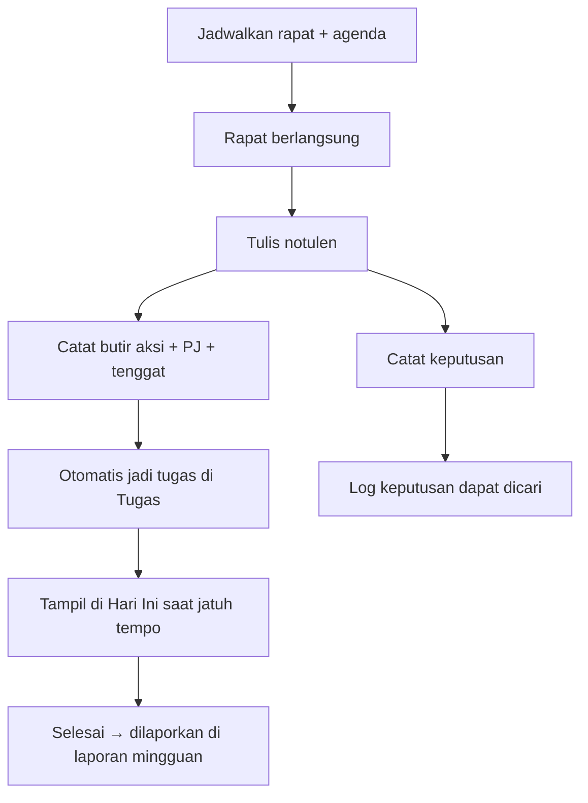

### 2.4 Alur pemangku kepentingan

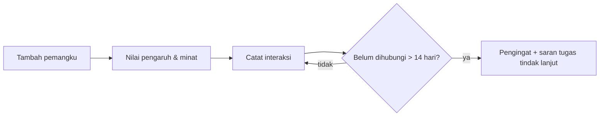

### 2.5 Alur kesiapan gerai

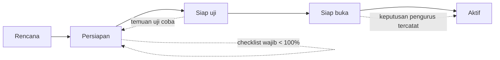

Syarat perpindahan status disarankan (bukan dipaksa): **Siap uji** ≥ 70% checklist wajib · **Siap buka** 100% checklist wajib + SOP disetujui + petugas terlatih · **Aktif** setelah keputusan pembukaan tercatat.

### 2.6 Alur laporan

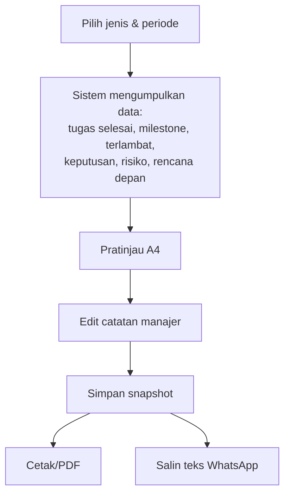

---

## 3. Alur Status Data

### 3.1 Tugas

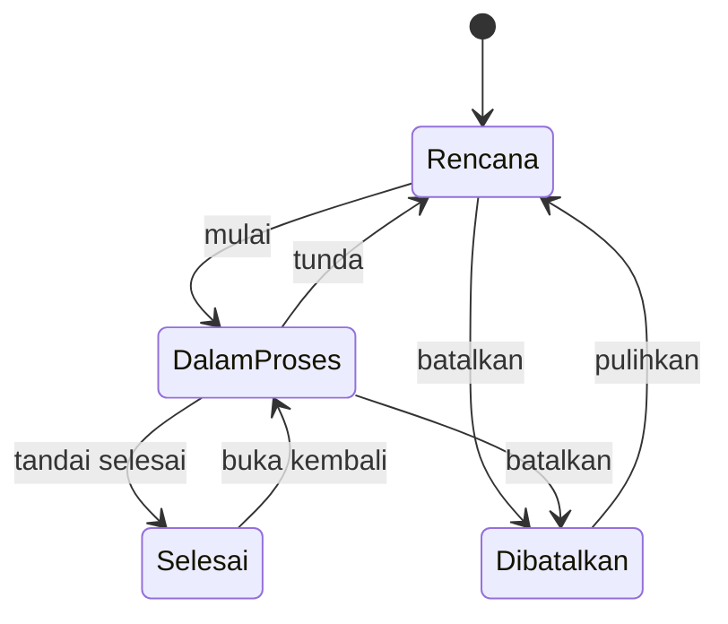

Penanda turunan (tidak disimpan): **Terlambat** = tenggat < hari ini dan status bukan Selesai/Dibatalkan · **Berisiko** = tenggat ≤ 2 hari dan progres < 50% atau ada prasyarat belum selesai.

### 3.2 Status milestone
- **Tepat waktu:** semua tugas anak on-track.
- **Berisiko:** ≥ 1 tugas anak berisiko atau tenggat ≤ 7 hari dengan progres < 70%.
- **Terlambat:** tanggal target lewat dan belum tercapai.
- **Tercapai:** semua tugas anak selesai; `actual_date` terisi.

### 3.3 Rumus progres (satu sumber kebenaran: `lib/progress.ts`)
- Progres tugas = subtugas selesai / total subtugas (atau 0/100 bila tanpa subtugas).
- Progres milestone/workstream = rata-rata progres tugas, bobot sama (bobot durasi opsional).
- Progres 90 hari = tugas selesai / tugas tidak dibatalkan.
- Kesiapan gerai = checklist wajib selesai / total checklist wajib gerai tersebut.

Angka yang sama dipakai oleh Beranda, Gerai, dan Laporan.

---

## 4. Alur Migrasi Data Lama

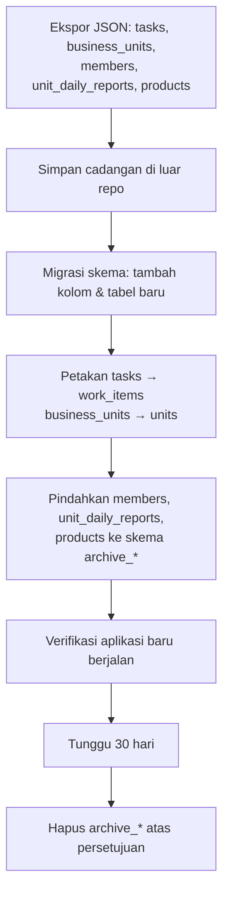

Data uji/demo dari Ladang Laweh **tidak** dimigrasikan; mulai dari data kosong Puntukrejo + template 90 hari.

